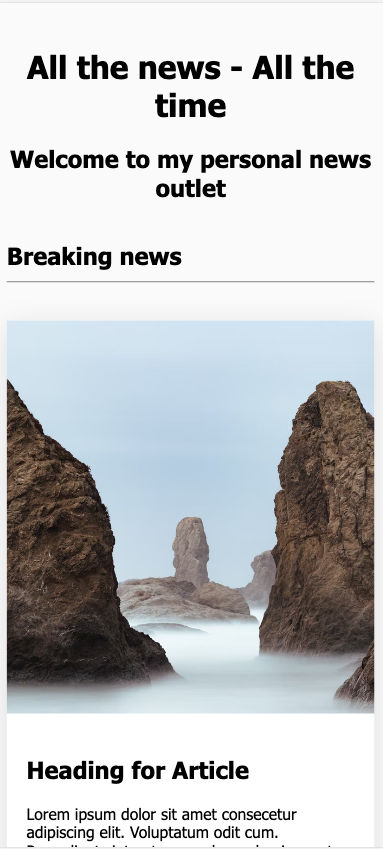
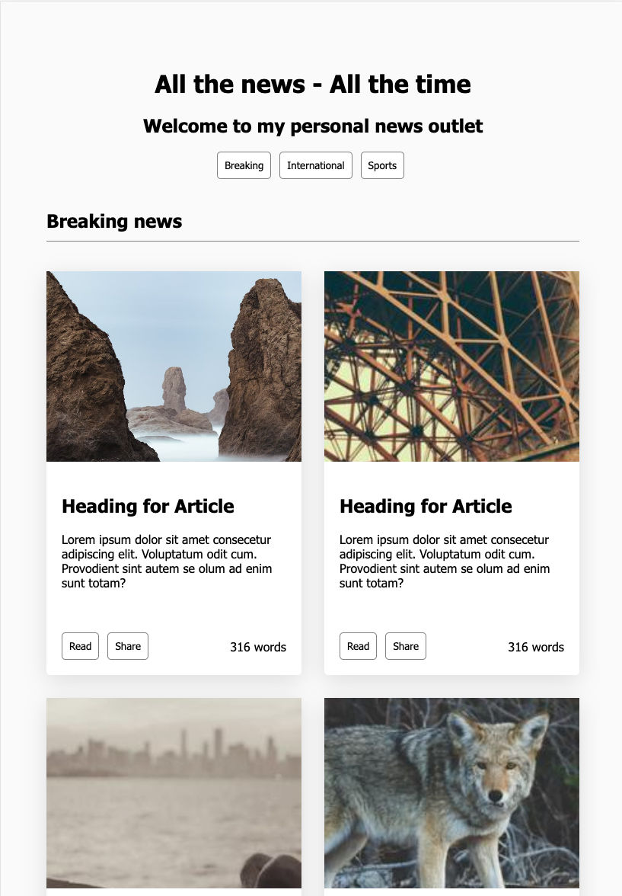

# CSS News Gallery

This test is all about HTML and CSS - and we're going to build a News site (without any functionality). Your task is simple: make a complete HTML page looking like the designs below.

The news site should:

- Present 3 different sections of news: Breaking, International, and Sports
  - There should be 4 news articles (with fictional content) in each section
- Each news article should:
  - Have a picture
  - Have a heading and content with some text (type `lorem10` and hit tab in VS code and see what it does)
  - Have two buttons (`Read` and `Share`) with a hover effect that changes the color of the button

You don't need to write any functionality; the buttons and links does not have to navigate anywhere. It's all about the structure and layout of the page for this weekend's test.

The CSS should be crafted with:

- A *mobile first* approach. (Start with 1 news-item per row and no navbar)
- Consideration for different browsers' compatibility, such as Chrome and Safari.
- A consistent naming convention and code style, linted (see below).

## Designs

Following are some Mock Ups for the website. Note that **they are not designs* that you have to follow 100%. But it is mandatory that the layout (structure of the page) be the same.

### Mobile



### Tablet



### Desktop


You should:

- Use a consistent naming convention, like BEM.
- Treat this like a client request. Take the design and implement it with the specified requirements.

You may use:

- More than one CSS file.
- Photos from <https://picsum.photos>.

You may **not**:

- Use Bootstrap, jQuery or similar.
- Create a blinking monster!

Good luck!

## Handing in the solution

Like always, commit and push your code to your personal repo before 8.30 on Monday morning.

## Usage
Clone the repository in your local machine.
Run the following command to install the dependencies
```bash
npm install
# or
yarn
```

Then run the following command to start the dev server:
```bash
npm run dev
# OR
yarn dev
```

## Lint
To analyze the code statically using ESLint, use the following command:
```bash
npm run lint
# OR
yarn lint
```

## Test
To run the tests, run the following command:
```bash
npm run test
# OR
yarn test
```
If you want to watch the files while the tests run, use the following command instead:
```bash
npm run test:watch
# OR
yarn test:watch
```

## Build
To generate the production build, run the following command:
```bash
npm run build
# OR
yarn build
```

## E2E (End to End) tests

We have written some end-to-end tests in [Cypress](https://www.cypress.io/) for you to use as a guide. You can verify that the page is displayed in the correct way for different viewport sizes, using these tests for example. We suggest that you manually compare the web app you've created against the mockups we've provided.

You are not supposed to change our tests, but you can add more tests if you want.

**OBS. This time we won't be grading you based on the results of the tests but rather on if your page follows the above designs.**

There are two ways of running the tests:

1. `npm run e2e:open` - this will open the Cypress window for you. Here you can see tests running visually by Cypress. It also reruns the tests if you change your code.
2. `npm run e2e` - this will run Cypress tests in headless mode, which means that it will not open a browser. It will, however, have the same output as the first command.

## FAQ

Should we use semantic HTML?
> Yes - absolutely.

Should we use semantic BEM for CSS class names?
> Of course.

Can we use any third party CSS library?
> No
